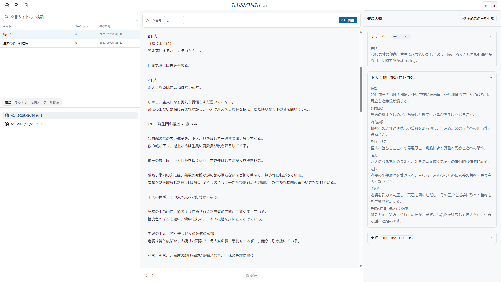
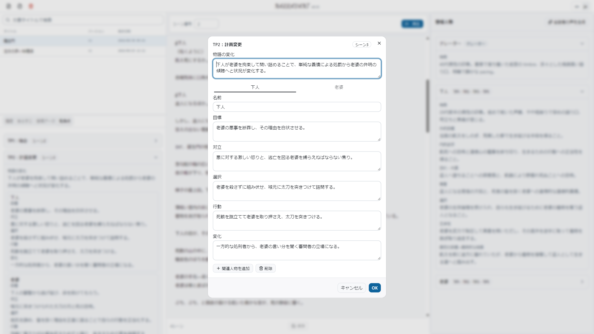

# NARRAVANT

[日本語](README.ja.md)

Current release: **0.1.3**.

NARRAVANT is an open source application that turns novels and screenplays into audiobook scripts and reads them aloud. It generates an audiobook script in [Fountain](https://fountain.io/) format from your source text, then uses Gemini TTS to play the narration and character voices in real time. It also analyzes the story through five turning points and an emotional arc. Background music and sound effects are not supported.

## Screenshots

| Analysis workbench | Five turning points |
| --- | --- |
|  |  |

### Demo

Real-time reading — import, analysis, voice design, and playback with auto-scroll:

https://github.com/user-attachments/assets/511a7b1d-07ab-4e1b-8aa5-9045ebe5dd8c

> The sample work shown here is from [Aozora Bunko](https://www.aozora.gr.jp/), a library of public-domain Japanese literature.

## Features

- **Script generation** — Upload a novel or screenplay (`.txt`, `.pdf`, `.fountain`, `.fdx`, or Native JSON) and generate an audiobook script in Fountain format, with narration and character dialogue.
- **Story analysis** — Generate and keep a synopsis, five turning points, and an emotional arc from the uploaded work.
- **Voice design** — Generate voice traits for the narrator and each character, then create voices with Gemini and assign them per speaker.
- **Real-time playback** — Synthesize each utterance in script order with Gemini TTS and stream it over WebSocket. Generated audio is not stored; playback is regenerated each time.
- **Local-first storage** — Scripts, voice traits, voice assignments, and analysis are saved in a local database. Export and re-import via Native JSON.
- **Bilingual UI** — Switch the interface between English and Japanese.

## Tech Stack

- **Backend** — Python 3.12+, FastAPI, SQLite (with `sqlite-vec` for valence similarity search), Google Gemini (analysis, Voice Design, and TTS).
- **Frontend** — React 19, TypeScript, Vite, Tailwind CSS, i18next (English / Japanese).
- **Tooling** — `uv` for the backend, `npm` for the frontend, `make` targets for setup, run, test, and lint.

## Prerequisites

- **Python 3.12+** and [`uv`](https://docs.astral.sh/uv/).
- **Node.js 24** (see `.nvmrc`) and `npm`.
- **`make`** (used by the setup and run commands below).
- A **Google Gemini Developer API key** with billing enabled.

## Setup and Getting Started

### 1. Environment Configuration (.env)
Copy `.env.example` to `.env` and configure the required environment variables:
```bash
cp .env.example .env
```
- `GEMINI_API_KEY`: **Required**. Your Google Gemini Developer API key.
- `GEMINI_MODEL`: Analysis and adaptation model (default: `gemini-3.8-flash`).
- `GEMINI_TTS_MODEL`: Speech synthesis model (default: `gemini-3.8-flash-tts`).
- `SQLITE_DB_PATH`: Path to the local SQLite database file (default: `./runtime/narravant.sqlite3`). Relative paths are resolved from the repository root (the directory containing `.env`).
- `LOCAL_STORAGE_PATH`: Directory for local script storage (default: `./runtime/storage`). Relative paths are resolved from the repository root (the directory containing `.env`).

> [!WARNING]
> **API Billing Notice**
> Calling the Gemini APIs (screenplay analysis, custom Voice Design, and TTS speech generation) will incur billable usage on your Google Cloud / Google AI Studio account. There is no in-app cost estimator or billing UI; please monitor your usage in the Google AI Studio console.

### 2. Startup (Two Processes)
Start the backend (FastAPI on port 8000) and frontend (Vite on port 5173) together:

```bash
# Initialize dependencies
make init

# Start both development servers
make run
```
Open `http://localhost:5173` in your browser.

To run each process separately, use `make dev-backend` (FastAPI on port 8000) and `make dev-frontend` (Vite on port 5173).

### 3. Basic Usage

1. **Import** a novel or screenplay (`.txt`, `.pdf`, `.fountain`, `.fdx`, or Native JSON). NARRAVANT generates a Fountain audiobook script and analyzes the story.
2. **Review the analysis** — synopsis, five turning points, and the emotional arc. Edit and save as needed.
3. **Design voices** — write voice traits for the narrator and each character, generate voices with Gemini, and assign them per speaker.
4. **Play** — start real-time playback from the current paragraph. The editor highlights and auto-scrolls to the spoken text.
5. **Export / import** via Native JSON to move a work between local databases.

Use **en / ja** to change the UI language.

## Development

- `make test` — run backend (`pytest`) and frontend (`vitest`) tests.
- `make lint` — run `ruff` (backend) and the frontend linter.
- `make clean` — remove local virtualenv, `node_modules`, build output, and the local database.

## Project Structure

```
backend/    FastAPI service: API, analysis/adaptation, Voice Design, TTS, local storage
frontend/   React + Vite web client (analysis workbench, playback, bilingual UI)
VERSION     Single source of truth for the release version
```

## Versioning

This project follows [Semantic Versioning](https://semver.org/). The release version is defined in [`VERSION`](VERSION); see [`CHANGELOG.md`](CHANGELOG.md) for release notes.

## References

See [REFERENCES.md](REFERENCES.md) for the research and technical specifications behind NARRAVANT, their use, and their limits.

## License

The software is licensed under the [MIT License](LICENSE), Copyright (c) 2026 Masayuki Irioka. It does not grant rights to imported books, third-party assets, or generated audio. You are responsible for permission to adapt and distribute the material you use.
